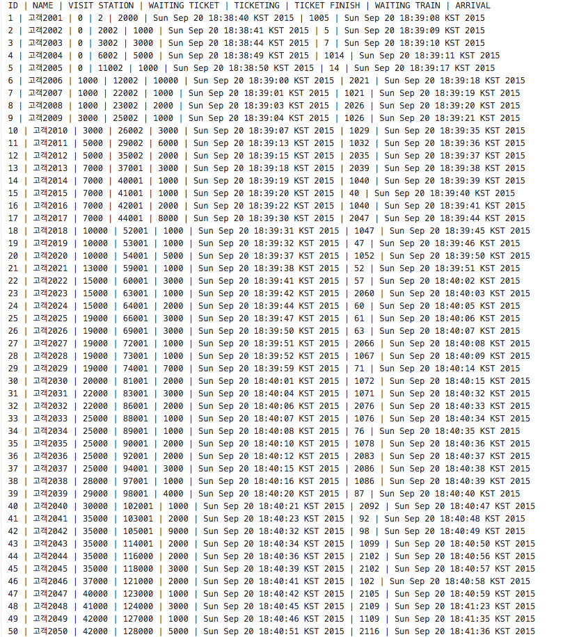

* __사용언어__ : java
* __프로그램 요구사항__
  1. 50 명의 고객이 순차적으로 승차권을 예매한다 (동시 3명 가능)								
  2. 3명의 상담원이 창구에서 티켓팅을 도와준다.								
  3. 고객의 정보에는 고객의 역에 도착시간, 티켓팅에 소요시간, 고객의 출발역, 도착역의 정보가 있다.								
  4. 고객은 지정된 시간에 역에 도착하고 가능한 매표소가 있으면 바로 티켓팅을 할 수 있다								  
  5. 고객이 역에 도착했으나 상담원이 모두 바빠서 티켓팅을 할 수 없으면 대기 시간에 포함된다.								
  6. 티켓팅을 한 고객은 플랫폼으로 가서 열차출발을 기다린다.								
  7. 열차 출발 시간이 되면 이전에 티켓팅하고 열차에 탑승하지 못한 모든 고객을 열차에 탑승한다.								
  8.  열차는 3분마다 출발한다.								
  9. 탑승한 고객의 출발역과 도착역을 고려하여 도착시간을 계산할 수 있다.								
  10. 입력 사항 : 고객아이디, 역 도착 시간, 티켓팅소요시간, 지역별 소요 시간표								
  11. 출력 사항: 고객정보, 티켓팅 대기시간, 티켓팅 시간, 열차대기시간, 열차 도착 시간								

* __git repository__
  - [trainStation](https://github.com/Kyoo32/NEXT2015-2/tree/master/java/final_train)

# result

