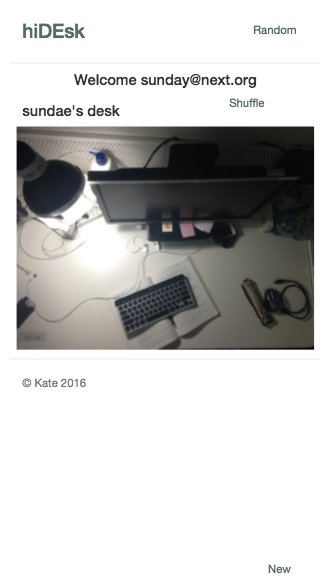

* __사용기술__ : nodejs, mysql / html,css,js
* __설명__ : 사진 콘텐츠를 통해 넥스트 구성원의 친목을 위해 폐쇄적 sns 웹을 기획했습니다. 구성원의 책상사진에 익명 댓글을 달 수 있습니다. 자신의 책상사진을 관리할 수 있습니다.
* __프로젝트 활동과 참여인원__
  - 웹 서비스 기획과 개발
  - 두명의 contributors와 기획, 개발
* __프로젝트 세부 활동__
  - 프로토타입 작성 (mobile first)
  - 서버, 클라이언트 개발
  - 활동 기록
* __git repository__
  - [hiDEsk](https://github.com/Kyoo32/NEXT_hiDEsk)

# Screenshots

