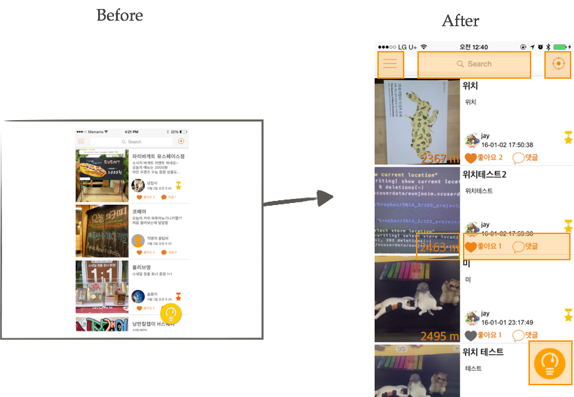
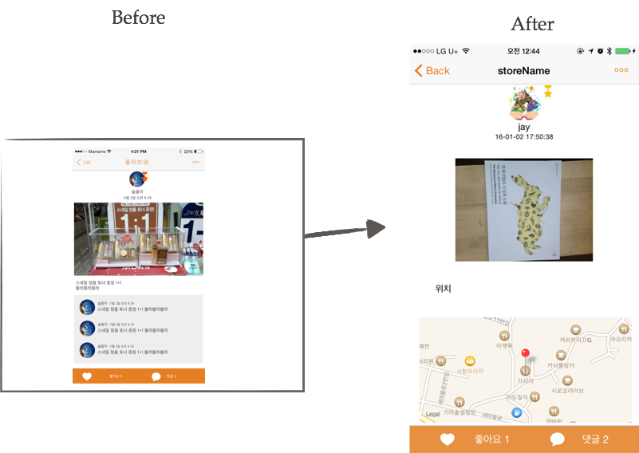
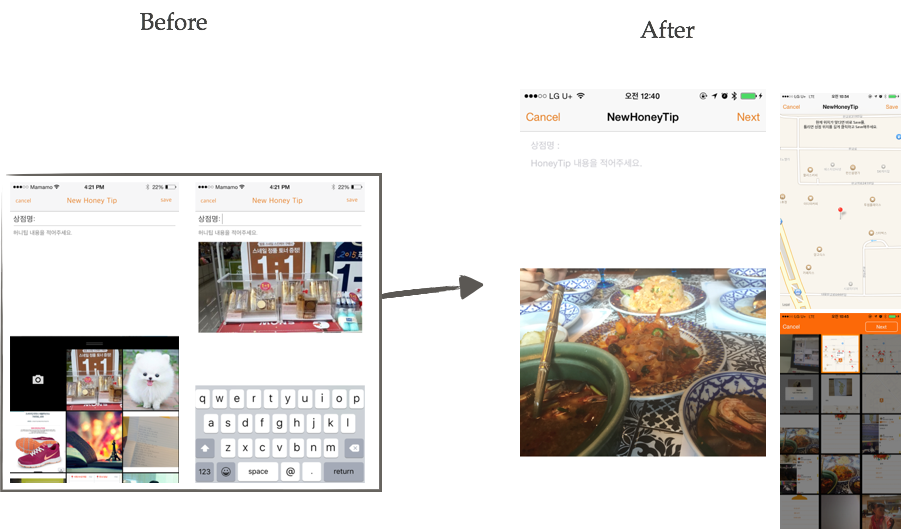
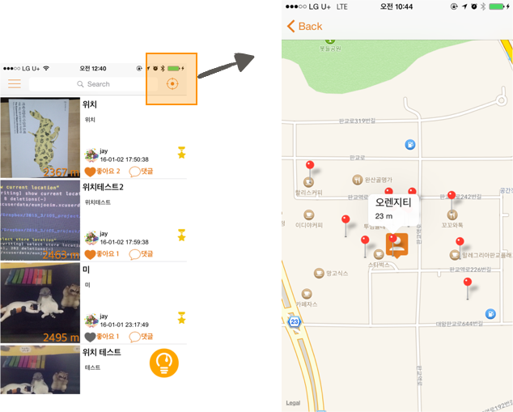

* __사용언어__ : object-c
* __설명__ : 사용자들이 지역에서 일어나는 이벤트에 대해 파악하고자 하는 니즈를 충족시키기 위해  앱을 기획했습니다. 지역생활권 사용자를 위한, 사용자에 의한 빠르고 간편한 지역 기반 이벤트 정보 알림을 제공합니다.
* __서비스 환경__ : iOS 8이상, nodejs, mongoDB
* __프로젝트 활동과 참여인원__
  - 앱 기획과 개발
  - 3인 공동 기획, 개발
* __프로젝트 기여 부분__
  - iOS client & logic : main, detail 뷰
  - 팀 활동 기록
* __git repository__
  - [iOS](https://github.com/Mamamoo-iOS/NearHoneyTip)
  - [server](https://github.com/Mamamoo-iOS/server)

# prototype과 구현 Screenshots

